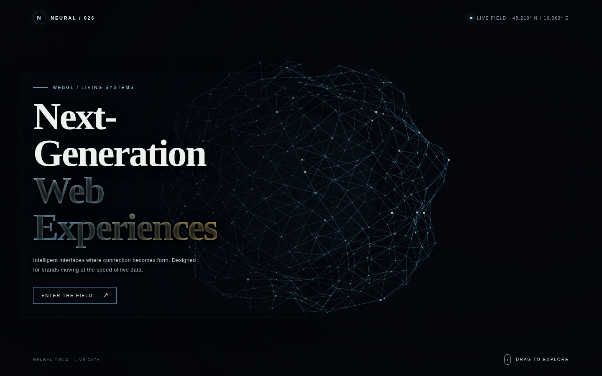

# Neural Network Landing Page

A 3D neural-network inspired landing page built with HTML, CSS, and Three.js. The experience features a dark futuristic interface, floating node network, and interactive motion to create a premium product showcase aesthetic.

## Project Overview
- 3D neural field background
- Interactive pointer and drag motion
- Futuristic hero section and CTA
- Built with plain HTML/CSS/JS and Three.js

## Preview
- Live demo: https://malother.github.io/my-ai-project/
- Screenshot: ./screenshot.png

## Run locally
```bash
cd /workspaces/my-ai-project
python3 -m http.server 3000
```
Then open http://localhost:3000

## Final Screenshot

